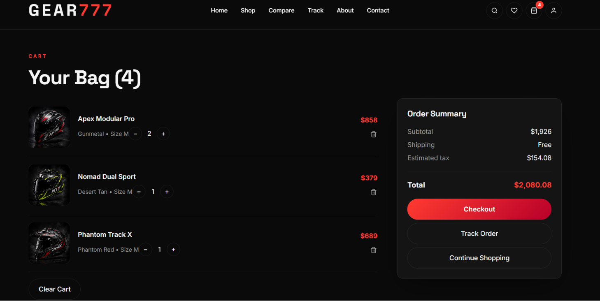

# GEAR777 – Premium Motorcycle Helmet Store

A modern, high-performance e-commerce storefront for premium motorcycle helmets, designed with a luxury user experience and responsive architecture.


## Screenshots
## Preview

### Home Page


### Shop Page


### Shopping Cart



## Live Demo

https://gear777-premium-helmet-store.vercel.app/


---

## Tech Stack

### Frontend
- React 18
- Vite
- React Router DOM v6
- Bootstrap 5
- Framer Motion
- Swiper JS
- React Icons

### State Management
- React Context API
- Custom Hooks

### UI/UX
- Responsive Design
- Dark Premium Theme
- Mobile-First Layout
- Smooth Animations

---

## Key Features

### Shopping Experience
- Product Catalog
- Advanced Search
- Category Filters
- Product Comparison
- Wishlist Management
- Shopping Cart

### Checkout Flow
- Multi-Step Checkout
- Order Summary
- Shipping Details UI
- Payment UI Integration Ready

### User Features
- Login Interface
- Registration Interface
- Order Tracking Dashboard
- User Profile Section

### Performance
- Lazy Loading
- Component-Based Architecture
- Reusable UI Components
- Optimized Asset Management

---

## Project Architecture

src/
├── assets/
├── components/
├── context/
├── hooks/
├── pages/
├── routes/
├── styles/
├── utils/
└── data/

---

## Installation

Clone the repository

```bash
git clone https://github.com/yourusername/gear777.git
```

Navigate to project

```bash
cd gear777
```

Install dependencies

```bash
npm install
```

Run development server

```bash
npm run dev
```

Create production build

```bash
npm run build
```

Preview production build

```bash
npm run preview
```

---

## Future Enhancements

- JWT Authentication
- Django REST API Integration
- MySQL Database
- Razorpay Payment Gateway
- Product Reviews
- Admin Dashboard
- Inventory Management
- Order Management System

---

## Deployment

- Vercel
- Netlify
- AWS Amplify

---

## Author

Akash

Frontend Developer

GitHub: https://github.com/Akash-Magandhran

LinkedIn:https://www.linkedin.com/in/akash-magandhran/

---